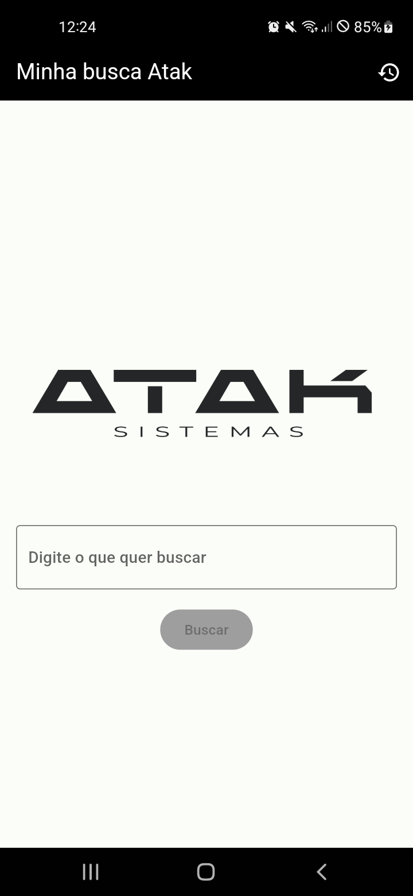
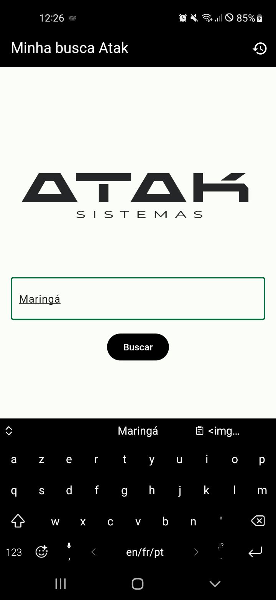
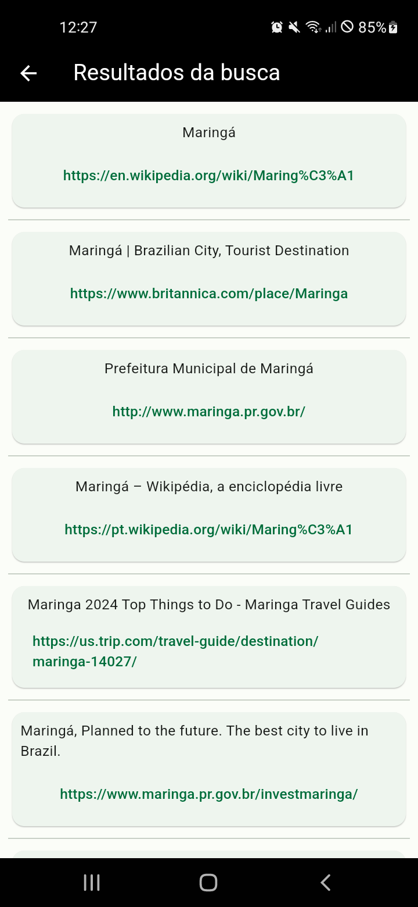
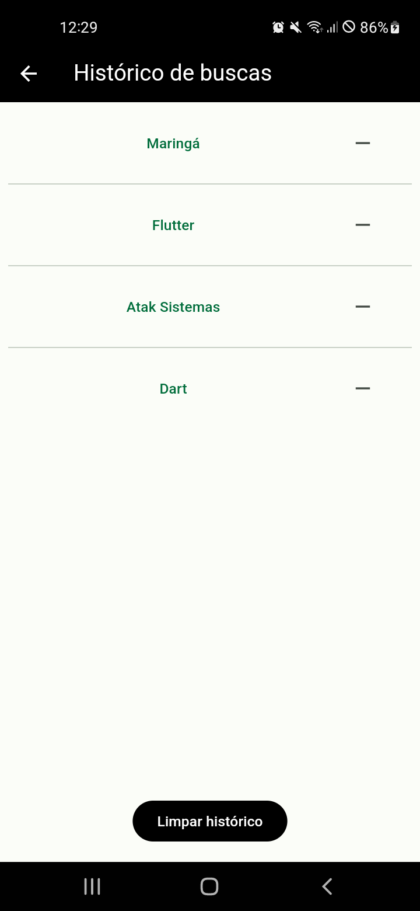

# Minha busca Atak

### Descrição

Este aplicativo permite ao seu usuário fazer uma busca na internet e ter os resultados do Google de forma simplificada, com o título e link de cada resultado

### Stacks utilizadas

* [Flutter](https://docs.flutter.dev/)
* [Dart](https://dart.dev/tools/dart-doc)
* [Android Studio](https://developer.android.com/studio)

### Requisitos técnicos

* Celular com Android ou emulador do Android Studio junto ao Flutter SDK.

### Como executar o aplicativo

Baixar o APK diretamente [aqui](https://github.com/dgomesdev/) e instalar no celular, ou clonar o repositório/baixar e descompactar o zip com o códdigo fonte e executar usando uma IDE como o Android Studio ou VS Code ou executar o seguinte comando no terminal, estando na pasta raiz do projeto:
```
flutter run
```

## Observação

O aplicativo realiza a busca consultando uma API que está hospedada em uma instãncia EC2 da AWS

### Screenshots

#### Página principal

 

#### Página de resultados

 

#### Página de histórico de buscas

 